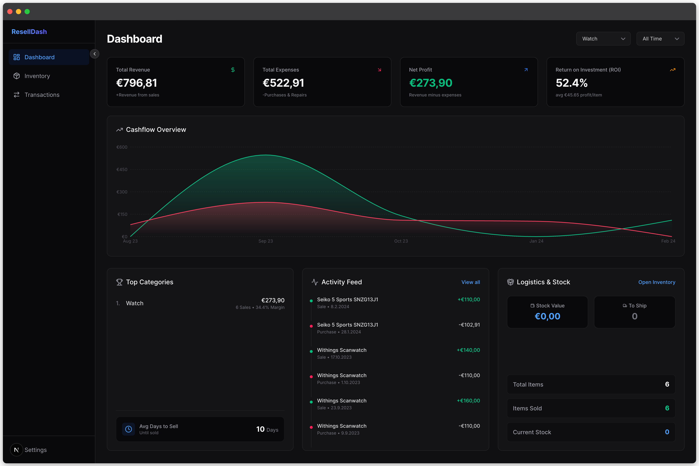

# Resell Dashboard



A sleek and modern Next.js web application designed to help you track your reselling business across platforms like **eBay**, **Vinted**, and **Kleinanzeigen**. Easily manage your inventory, record sales and repairs, and monitor your cashflow with dynamic charts.

## Features

- **Inventory Management**: Keep track of purchased items, their status (e.g., In Stock, In Repair, Sold), and your active listings on platforms like eBay or Vinted.
- **Transaction Tracking**: Log all expenses and income, including spare parts or shipping fees, to automatically calculate your exact profit margins.
- **Dynamic Dashboard**: Beautiful KPI cards and Recharts integration to visualize your spending and revenue over time.
- **Localization**: Full bilingual support (English and German) with language persistence.
- **Customizable Settings**: Add custom colored categories and custom status labels directly from the UI.
- **Built-in Backups**: Export your entire database (transactions and inventory) to CSV with a single click.

## Tech Stack

- [Next.js](https://nextjs.org/) (App Router, React Server Components)
- [Tailwind CSS](https://tailwindcss.com/) for styling
- [Supabase](https://supabase.com/) for PostgreSQL database and backend API
- [Recharts](https://recharts.org/) for data visualization
- [Lucide React](https://lucide.dev/) for iconography

## Getting Started

### 1. Clone the repository

```bash
git clone https://github.com/jonashuberts/resell_dashboard.git
cd resell_dashboard
```

### 2. Install dependencies

```bash
npm install
```

### 3. Supabase Setup

1. Create a new project on [Supabase](https://supabase.com/).
2. Navigate to the SQL Editor in your Supabase dashboard and run the setup scripts (which you can find inside the Settings menu of this app, or define your own `items`, `transactions`, `category_settings`, and `status_settings` tables).
3. Copy your project URL and target `anon` key from the Supabase API settings.

### 4. Environment Variables

Create a new file named `.env.local` in the root of the project:

```bash
cp .env.example .env.local
```

Open `.env.local` and add your Supabase credentials:

```env
NEXT_PUBLIC_SUPABASE_URL=your_supabase_project_url
NEXT_PUBLIC_SUPABASE_ANON_KEY=your_supabase_anon_key
```

### 5. Run the Application

```bash
npm run dev
```

Open [http://localhost:3000](http://localhost:3000) with your browser to see the result.

## Deployment (Vercel)

The easiest way to deploy your Resell Dashboard is to use the [Vercel Platform](https://vercel.com/new).

1. Push your code to a GitHub repository.
2. Go to Vercel and import your repository.
3. **CRITICAL:** Before hitting deploy, or if you get a `500 Internal Server Error`, you must add your Supabase Environment Variables to Vercel!
   - Navigate to **Settings > Environment Variables** in your Vercel project.
   - Add `NEXT_PUBLIC_SUPABASE_URL` and `NEXT_PUBLIC_SUPABASE_ANON_KEY` with the same values from your local `.env.local` file.
4. Hit **Deploy** or trigger a **Redeploy** if you added the variables after a failed attempt.

## License

This project is licensed under the **GNU Affero General Public License v3.0 (AGPL-3.0)**. 
This means you are free to use, modify, and distribute the code for **personal, educational, or commercial purposes**. However, if you modify the software and make it available over a network (like running it as a service), you *must* also share your modified source code under the same AGPL-3.0 license.

See the [LICENSE](LICENSE) file for the full legal text.
