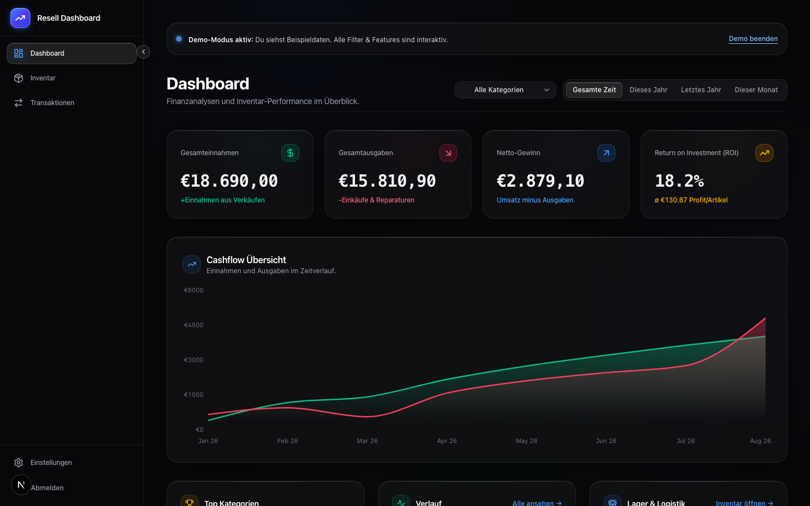

# Resell Dashboard



A modern, fast, and intuitive web application to track and manage reselling operations across platforms like **eBay**, **Vinted**, **Kleinanzeigen**, **Amazon**, and private sales. Manage your inventory, record purchases, calculate exact profits, and monitor cashflow in real time.

**Live Demo**: Test the dashboard immediately without creating an account. On the login page, click **"Live-Demo ausprobieren / Try Live Demo"** to explore the interactive sample data.

---

## Features

- **Inventory Management**: Track purchased items, active listings, and statuses (*In Stock*, *In Repair*, *Sold*, *To Ship*).
- **Profit & Margin Calculation**: Log purchase prices, selling prices, platform fees, and repair costs to calculate net profits and ROI per item.
- **Cashflow & Analytics**: Interactive charts and KPI widgets showing revenue, expenses, top-performing categories, and average selling speed (*Days to Sell*).
- **Instant Search & Filtering**: Client-side filtering by category, status, type, and keyword with zero latency.
- **Custom Categories & Statuses**: Create, color-code, and organize custom product categories and workflow statuses.
- **Bilingual (DE / EN)**: Full German and English language support with instant switching and persistence.
- **Database Backup**: Export your complete inventory and transaction history to CSV at any time.

---

## Tech Stack

- **Frontend & Backend**: [Next.js](https://nextjs.org/) (React Server Components, App Router, Turbopack)
- **Styling**: [Tailwind CSS](https://tailwindcss.com/)
- **Database & Auth**: [Supabase](https://supabase.com/) (PostgreSQL)
- **Data Visualization**: [Recharts](https://recharts.org/)
- **Icons**: [Lucide React](https://lucide.dev/)

---

## Local Setup

### 1. Clone the repository
```bash
git clone https://github.com/jonashuberts/resell_dashboard.git
cd resell_dashboard
```

### 2. Install dependencies
```bash
npm install
```

### 3. Environment Variables
Create a `.env.local` file in the project root:
```env
NEXT_PUBLIC_SUPABASE_URL=your_supabase_project_url
NEXT_PUBLIC_SUPABASE_ANON_KEY=your_supabase_anon_key
```

### 4. Run Development Server
```bash
npm run dev
```
Open [http://localhost:3000](http://localhost:3000) in your browser.

---

## Deployment on Vercel

1. Import the repository into [Vercel](https://vercel.com/new).
2. Under **Project Settings > Environment Variables**, add `NEXT_PUBLIC_SUPABASE_URL` and `NEXT_PUBLIC_SUPABASE_ANON_KEY`.
3. Click **Deploy**.

---

## License

This project is open-source under the **GNU Affero General Public License v3.0 (AGPL-3.0)**. See the [LICENSE](LICENSE) file for details.
